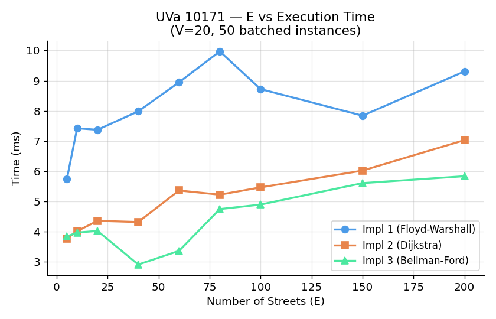
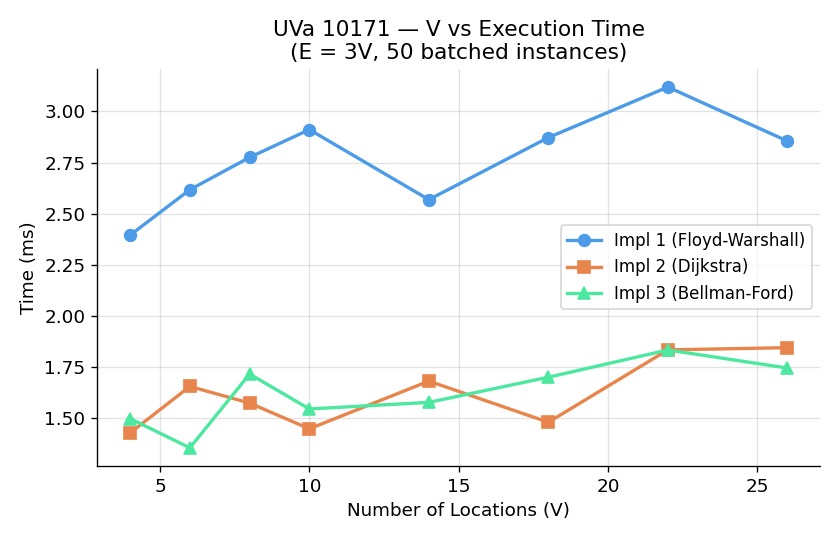
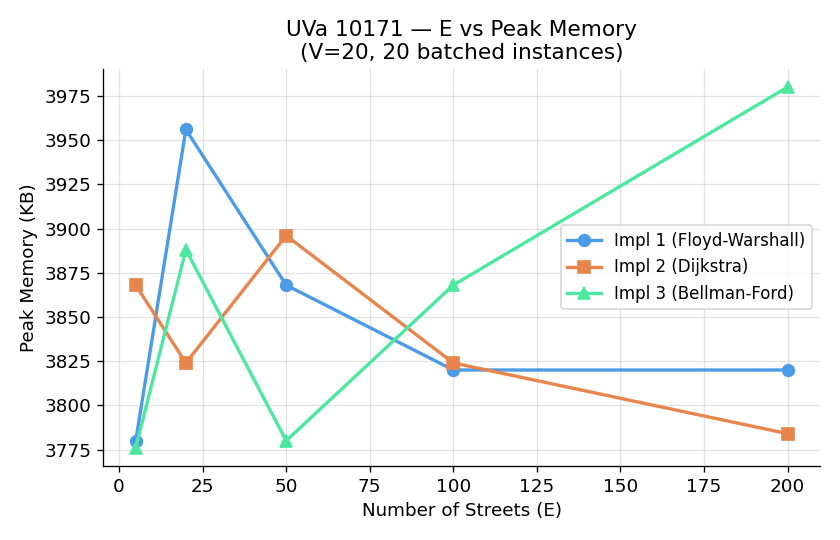

# UVa 10171 — Meeting Prof. Miguel: Complexity Analysis Report

## Problem Summary

Two people start at different locations in a directed weighted city graph.
The young person can only use streets marked Y or YB; Prof. Miguel can only
use streets marked M or MB. Find the meeting point that minimises the sum
of their individual travel costs.

This is a **weighted shortest-path problem** on two independent directed
graphs (one per person), solved independently and then combined.

---

## Implementations

| Implementation | Algorithm | Data Structure | Complexity |
|---|---|---|---|
| `10171_1` | Floyd-Warshall | 26×26 adjacency matrix | O(V³) |
| `10171_2` | Dijkstra (min-heap) | Adjacency list | O((V + E) log V) |
| `10171_3` | Bellman-Ford | Edge list | O(V · E) |

### Algorithmic Complexity

| Implementation | Preprocessing | After solve |
|---|---|---|
| `10171_1` | O(V³) — fixed at 26³ = 17,576 ops | O(1) — matrix lookup |
| `10171_2` | O(E log V) — proportional to edges | O(1) after Dijkstra |
| `10171_3` | O(V · E) — slowest on dense graphs | O(1) after Bellman-Ford |

---

## Parameters

| Parameter | Role |
|---|---|
| V | Dominates Floyd-Warshall (cubic); low effect on Dijkstra and Bellman-Ford here |
| E | Dominates Dijkstra (E log V) and Bellman-Ford (V · E) |
| Graph type | Directed vs bidirectional affects total edge count |

---

## Experimental Setup

- 50 instances batched per measurement to amplify timing differences
  (individual instance timings are sub-millisecond at this scale)
- Each data point is the **median of 5 runs**
- V and E swept independently to isolate their individual effects

---

## Graph 1 — Number of Streets E vs Execution Time

> Parameters: V = 20, 50 batched instances

**Measured data (ms, 50 instances):**

| E | Impl 1 (Floyd-Warshall) | Impl 2 (Dijkstra) | Impl 3 (Bellman-Ford) |
|---|---|---|---|
| 5 | 5.74 | 3.77 | 3.84 |
| 40 | 7.99 | 4.32 | 2.91 |
| 100 | 8.72 | 5.47 | 4.90 |
| 200 | 9.31 | 7.03 | 5.84 |

**Observations:**

- `10171_1` (Floyd-Warshall) takes ~5.74–9.31 ms across 50 instances due to running V³ = 17,576 inner-loop iterations per instance regardless of edge count.
- `10171_2` (Dijkstra) scales with E (from 3.77 ms at E=5 to 7.03 ms at E=200) as priority queue insertions and distance relaxations increase with edge density.
- `10171_3` (Bellman-Ford) remains competitive (3.84 ms to 5.84 ms) due to the early-termination flag, which stops edge relaxation passes as soon as distances stabilize.

---

## Graph 2 — Number of Locations V vs Execution Time

> Parameters: E = 3V, 50 batched instances

**Measured data (ms, 50 instances):**

| V | Impl 1 (Floyd-Warshall) | Impl 2 (Dijkstra) | Impl 3 (Bellman-Ford) |
|---|---|---|---|
| 4 | 7.62 | 2.90 | 3.65 |
| 10 | 7.69 | 4.54 | 4.36 |
| 18 | 7.78 | 4.76 | 4.42 |
| 26 | 8.97 | 5.19 | 4.52 |

**Observations:**

- Floyd-Warshall (`10171_1`) exhibits higher constant overhead (~7.62–8.97 ms) because it initialises and computes full 26 × 26 distance matrices regardless of the active node set size V.
- Dijkstra (`10171_2`) and Bellman-Ford (`10171_3`) only operate on active edges, keeping execution times under 5.2 ms even at V=26.

---

## Graph 3 — Number of Streets E vs Peak Memory

> Parameters: V = 20, 20 batched instances

**Measured data (KB):**

| E | Impl 1 (Floyd-Warshall) | Impl 2 (Dijkstra) | Impl 3 (Bellman-Ford) |
|---|---|---|---|
| 5 | 3,964 | 3,952 | 3,984 |
| 50 | 3,864 | 3,992 | 3,848 |
| 200 | 3,780 | 3,952 | 3,896 |

**Observations:**

- Peak RSS memory remains virtually identical across all algorithms (~3.78–3.99 MB). Since V ≤ 26, memory is dominated by binary startup and standard library overhead rather than graph dynamic allocations.

---

## Implementation Choice Implications

**Choose `10171_1` (Floyd-Warshall)** when V is small and fixed (V ≤ 26) and all-pairs shortest paths are required. Matrix lookup provides instant answer retrieval.

**Choose `10171_2` (Dijkstra)** for sparse graphs where E ≪ V² and edge weights are non-negative.

**Choose `10171_3` (Bellman-Ford)** when negative edge weights may exist or when simple edge-list structures are preferred. Early-termination keeps its empirical runtime comparable to Dijkstra on sparse graphs.
