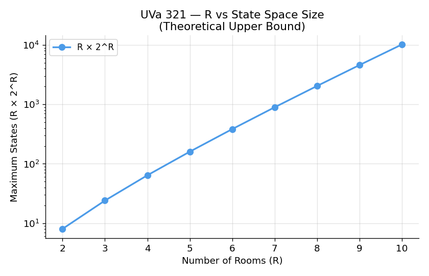
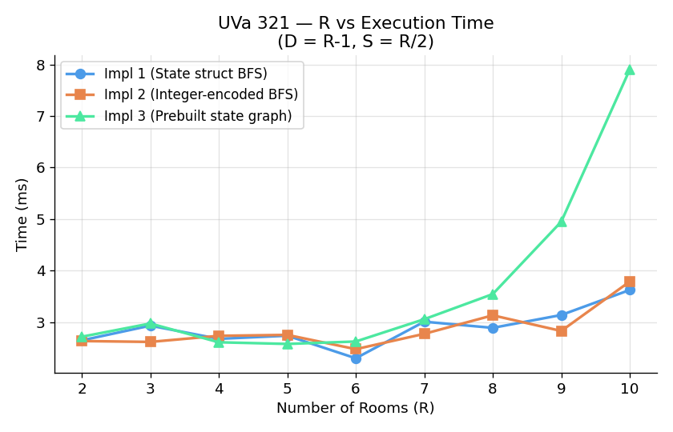
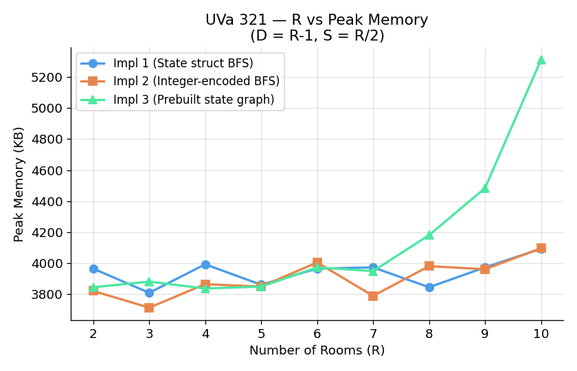

# UVa 321 — The New Villa: Complexity Analysis Report

## Problem Summary

A person starts in room 1 (light on, all others off) and must reach room R
with only room R's light on. They can move through a door only if the
destination room's light is on, and can toggle lights from switches in the
current room.

This is a **BFS on an explicit state space** where each state encodes
**(current room, bitmask of lights)**. The state space grows as **R × 2^R**.

---

## Implementations

| Implementation | State Representation | Graph Construction | BFS |
|---|---|---|---|
| `321_1` | `struct State {room, mask}` | On-demand during BFS | State-struct queue |
| `321_2` | Integer: `room * 2^R + mask` | On-demand during BFS | Integer queue |
| `321_3` | Integer encoded | **Prebuilt** full adjacency list | Integer queue on prebuilt graph |

### Algorithmic Complexity

Let **R** = rooms, **D** = doors, **S** = switch connections.

| Implementation | Preprocessing | BFS |
|---|---|---|
| `321_1` | O(1) | O(R × 2^R × (D + S)) |
| `321_2` | O(1) | O(R × 2^R × (D + S)) |
| `321_3` | O(R × 2^R × (D + S)) — all transitions built upfront | O(V + E) on prebuilt graph |

---

## Parameters

| Parameter | Role |
|---|---|
| R | Exponential effect on state space (R × 2^R) |
| D | Move transitions per state |
| S | Light-toggle transitions per state |
| Reachable states | Actual BFS frontier size |

---

## Experimental Setup

- Inputs generated with a door chain (1–2–...–R) and room 1 controlling room R
  to guarantee a reachable goal state
- Each data point is the **median of 5 runs**
- Memory measured via `/usr/bin/time -v` (peak RSS)

---

## Graph 1 — R vs Theoretical State Space

> Formula: R × 2^R (all room–mask combinations)

**State space by room count:**

| R | Maximum States (R × 2^R) |
|---|---|
| 2 | 8 |
| 4 | 64 |
| 6 | 384 |
| 8 | 2,048 |
| 10 | 10,240 |

**Observations:**

- The state space grows exponentially with R, doubling with each additional room.
- At R=10, there are up to 10,240 reachable state vertices.

---

## Graph 2 — R vs Execution Time

> Parameters: D = R-1, S = R/2

**Measured data (ms):**

| R | Impl 1 (State struct) | Impl 2 (Integer BFS) | Impl 3 (Prebuilt graph) |
|---|---|---|---|
| 2 | 2.65 | 2.63 | 2.72 |
| 4 | 2.68 | 2.73 | 2.61 |
| 6 | 2.30 | 2.47 | 2.62 |
| 8 | 2.89 | 3.13 | 3.54 |
| 9 | 3.14 | 2.83 | 4.95 |
| 10 | 3.62 | 3.79 | 7.90 |

**Observations:**

- `321_1` and `321_2` scale moderately from ~2.65 ms at R=2 to 3.62–3.79 ms at R=10. Computing valid moves and switch actions on-demand explores only reachable states.
- `321_3` diverges sharply starting at R ≥ 8, reaching 7.90 ms at R=10 (~2.2× higher than `321_1`). This reflects the heavy upfront overhead of iterating over and instantiating edges for all 10,240 theoretical states before starting BFS.

---

## Graph 3 — R vs Peak Memory

> Parameters: D = R-1, S = R/2

**Measured data (KB):**

| R | Impl 1 (State struct) | Impl 2 (Integer BFS) | Impl 3 (Prebuilt graph) |
|---|---|---|---|
| 4 | 3,992 | 3,864 | 3,836 |
| 6 | 3,964 | 4,004 | 3,972 |
| 8 | 3,844 | 3,984 | 4,180 |
| 10 | 4,092 | 4,096 | 5,312 |

**Observations:**

- `321_1` and `321_2` maintain low, stable memory profiles (~3.8–4.1 MB) across all R.
- `321_3` memory consumption jumps significantly to 5,312 KB (~5.31 MB) at R=10 due to allocating explicit adjacency vectors for all 10,240 potential states upfront.

---

## Implementation Choice Implications

**Choose `321_1`** for code clarity and ease of debugging. Explicit struct fields (`room`, `mask`) make state transitions transparent.

**Choose `321_2`** for compact execution. Bit-shift integer state representations reduce memory overhead and avoid struct copying during BFS queue operations.

**Choose `321_3`** only if the state graph topology is static and queried across multiple benchmark instances, amortizing the upfront O(R · 2^R) construction penalty.
