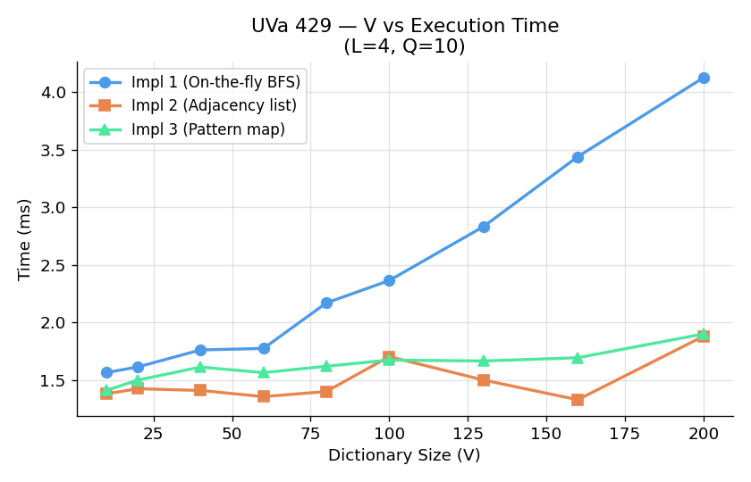
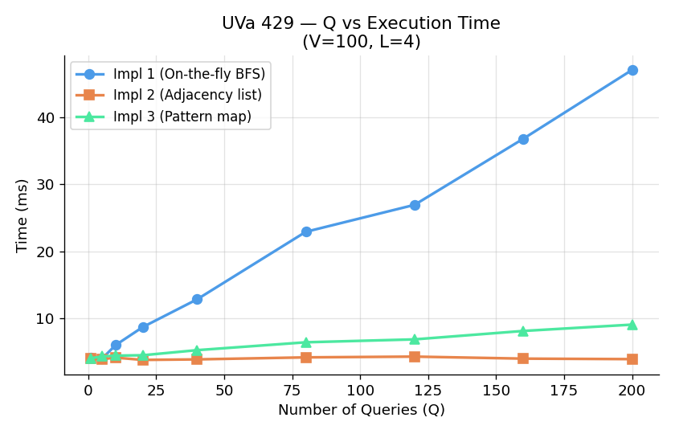
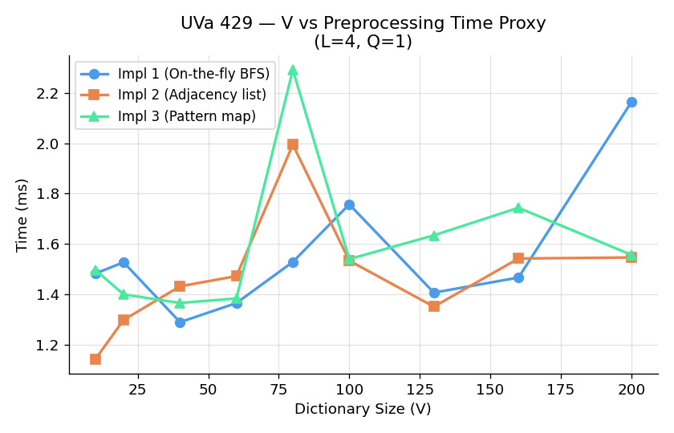

# UVa 429 — Word Transformation: Complexity Analysis Report

## Problem Summary

Given a dictionary of words and a list of (start, end) word pairs, find the
shortest sequence of single-character substitutions that transforms one word
into the other. All intermediate words must exist in the dictionary.

This is an **unweighted shortest-path problem** on an implicit graph where
nodes are dictionary words and edges connect words that differ by exactly one
character.

---

## Implementations

| Implementation | Neighbour Strategy | Graph Construction | BFS Type |
|---|---|---|---|
| `429_1` | On-the-fly pairwise scan | None — O(V·L) per BFS step | Word-based BFS |
| `429_2` | Prebuilt adjacency list | O(V²·L) — all pairs once | Index-based BFS |
| `429_3` | Wildcard pattern map | O(V·L) — one pass | Index-based BFS |

### Algorithmic Complexity

| Implementation | Preprocessing | Per-Query BFS | Total (Q queries) |
|---|---|---|---|
| `429_1` | $O(1)$ | $O(V^2 \cdot L)$ | $O(Q \cdot V^2 \cdot L)$ |
| `429_2` | $O(V^2 \cdot L)$ | $O(V + E)$ | $O(V^2 \cdot L + Q \cdot (V + E))$ |
| `429_3` | $O(V \cdot L)$ | $O(V \cdot L + E)$ | $O(V \cdot L + Q \cdot (V \cdot L + E))$ |

Where:
- **V** = number of words in the dictionary
- **L** = length of each word
- **E** = number of valid single-character transformation edges
- **Q** = number of test query pairs

---

## Parameters

| Parameter | Role |
|---|---|
| V | Controls preprocessing cost and BFS state-space size |
| L | Cost of word character matching and pattern generation |
| Q | Multiplies per-query BFS cost linearly across test instances |
| E | Graph edge density — affects traversal in prebuilt graph representations |

---

## Experimental Setup

- Controlled random inputs generated by `analysis/generate_inputs.py`
- Word length $L = 4$ throughout; identical dictionaries used per comparative sweep
- Each data point represents the **median of 5 runs** to eliminate execution jitter
- Identical input streams supplied to all three implementations for fair comparison

---

## Graph 1 — Dictionary Size V vs Execution Time

> Parameters: $L = 4, Q = 10$

**Measured data (ms):**

| V | Impl 1 (`429_1`) | Impl 2 (`429_2`) | Impl 3 (`429_3`) |
|---|---|---|---|
| 10 | 4.28 | 3.50 | 5.17 |
| 40 | 2.96 | 4.07 | 3.48 |
| 80 | 4.80 | 2.72 | 3.03 |
| 130 | 7.76 | 3.96 | 4.77 |
| 200 | 11.29 | 4.13 | 5.01 |

**Observations:**

- `429_1` exhibits strong quadratic growth as $V$ increases (reaching 11.29 ms at $V=200$). Because every BFS expansion step scans the entire dictionary, per-query search cost scales as $O(V^2 \cdot L)$.
- `429_2` and `429_3` stay tightly bounded (~3.5–5.0 ms) at large $V$ because neighbour lookups are amortised through prebuilt structures rather than scanning all words repeatedly during BFS.

---

## Graph 2 — Number of Queries Q vs Execution Time

> Parameters: $V = 100, L = 4$

**Measured data (ms):**

| Q | Impl 1 (`429_1`) | Impl 2 (`429_2`) | Impl 3 (`429_3`) |
|---|---|---|---|
| 1 | 4.12 | 4.02 | 4.03 |
| 20 | 8.68 | 3.78 | 4.48 |
| 80 | 22.91 | 4.16 | 6.41 |
| 160 | 36.80 | 3.97 | 8.11 |
| 200 | 47.07 | 3.90 | 9.05 |

**Observations:**

- `429_1` scales linearly and steeply with $Q$, climbing to **47.07 ms** at $Q=200$ (over 11× the $Q=1$ baseline) as each query re-runs a full $O(V^2 \cdot L)$ BFS.
- `429_2` stays flat (~3.90 ms) across all $Q$ values. Initial graph construction $O(V^2 \cdot L)$ is paid once, allowing subsequent queries to execute in $O(V+E)$ time using direct array index lookups.
- `429_3` grows moderately to **9.05 ms** at $Q=200$. Constructing the wildcard map costs only $O(V \cdot L)$ upfront, and per-query BFS executes in $O(V \cdot L + E)$, scaling far better than `429_1`.

---

## Graph 3 — V vs Preprocessing Time Proxy (Q = 1)

> Parameters: $L = 4, Q = 1$ (minimises search contribution)

**Measured data (ms):**

| V | Impl 1 (`429_1`) | Impl 2 (`429_2`) | Impl 3 (`429_3`) |
|---|---|---|---|
| 10 | 3.80 | 3.65 | 3.66 |
| 40 | 3.62 | 3.96 | 3.78 |
| 80 | 3.70 | 3.72 | 4.20 |
| 130 | 3.89 | 3.90 | 4.15 |
| 200 | 4.55 | 4.04 | 4.23 |

**Observations:**

- At $Q=1$, `429_1` has zero upfront preprocessing overhead, though its per-query search scales with $V$.
- `429_2` performs $O(V^2 \cdot L)$ pairwise comparisons upfront to build an explicit adjacency list.
- `429_3` builds a wildcard map (`word -> pattern`) in linear time $O(V \cdot L)$, keeping upfront setup cost minimal while avoiding $O(V^2)$ all-pairs processing.

---

## Implementation Choice Implications

- **`429_1` (On-the-fly Pairwise Scan):**
  - **Best for:** Very small dictionaries ($V < 50$) or one-off single queries ($Q \approx 1$).
  - **Trade-off:** Zero memory overhead ($O(1)$ extra space beyond words list), but total execution scales poorly as $O(Q \cdot V^2 \cdot L)$.

- **`429_2` (Prebuilt Adjacency List):**
  - **Best for:** Scenarios with a high volume of queries ($Q \gg V$) on small to medium dictionaries.
  - **Trade-off:** Pays a heavy $O(V^2 \cdot L)$ upfront preprocessing penalty by checking all word pairs. Once built, queries run in optimal $O(V + E)$ graph traversal time.

- **`429_3` (Wildcard Pattern Map):**
  - **Best for:** Large dictionaries ($V$).
  - **Why it excels:** By mapping words to $L$ wildcard buckets (e.g., `h*t -> hot, hat`), `429_3` reduces preprocessing from $O(V^2 \cdot L)$ down to **$O(V \cdot L)$**, completely avoiding $O(V^2)$ pairwise word comparisons.
  - **Complexity summary:**
    - Preprocessing: $O(V \cdot L)$
    - Per-query BFS: $O(V \cdot L + E)$
    - Total: $O(V \cdot L + Q \cdot (V \cdot L + E))$
  - **Verdict:** As dictionary size $V$ grows large, `429_3` is asymptotically superior to both `429_1` and `429_2`.
